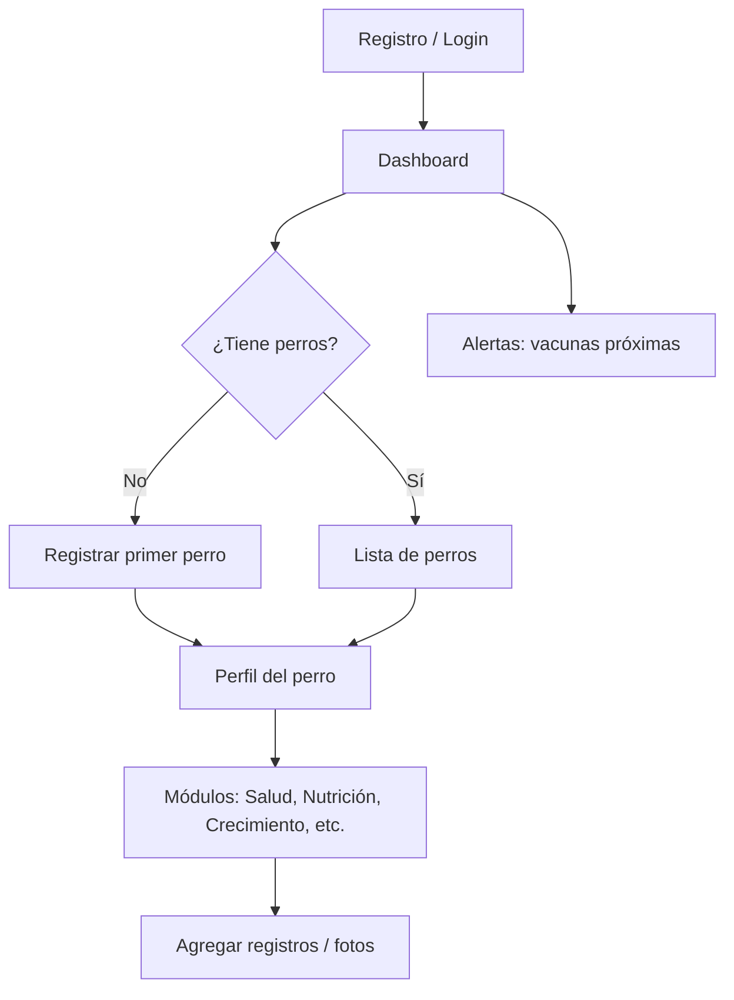

# Plan de Implementación: Portal de Gestión del Ciclo de Vida Canino

---

## Resumen ejecutivo

Plataforma web full-stack para que dueños registren y administren el ciclo de vida completo de sus perros: desde nacimiento/bautizo, salud, nutrición, crecimiento, gustos, ropa, momentos memorables, seguro de vida, hasta memorial.

**Contexto del proyecto**: Actividad académica (Actividad 2) con **orientación empresarial** — el entregable principal es demostrar capacidad de **planificación y diseño de software** (arquitectura, modelo de datos, flujos, API, fases). La implementación sigue el plan, pero el foco evaluable es la calidad del planning.

**Stack confirmado**: Monorepo · **Next.js + TypeScript** · **NestJS** · **PostgreSQL** · almacenamiento local de archivos · **Docker Compose** (stack completo) · UI en **español** · Auth **email + password con JWT**.

El proyecto arranca **desde cero**. Este documento cubre arquitectura, modelo de datos, pantallas, API, MVP, roadmap, datos de prueba y fases de implementación.

---


## Decisiones confirmadas


| #   | Decisión                   | Respuesta                                          | Implicación técnica                                             |
| --- | -------------------------- | -------------------------------------------------- | --------------------------------------------------------------- |
| 1   | Naturaleza del proyecto    | Académico, orientación empresarial                 | Énfasis en documentación y planning riguroso                    |
| 2   | Estructura                 | **Monorepo** (`apps/web`, `apps/api`)              | Un solo repo, scripts compartidos                               |
| 3   | Almacenamiento de imágenes | **Local** (por ahora)                              | `uploads/` en API + volumen Docker                              |
| 4   | Notificaciones             | **In-app + WhatsApp**                              | Tabla `notifications` + integración WhatsApp Cloud API / Twilio |
| 5   | Roles admin                | **Sub-roles con vistas distintas**, lectura global | Campo `admin_subtype` + layouts por rol                         |
| 6   | Idioma UI                  | **Español**                                        | Sin i18n en V1                                                  |
| 7   | Autenticación              | **Email + password, JWT**                          | Passport JWT, sin OAuth                                         |
| 8   | Infraestructura            | **Dockerizado**                                    | `docker-compose.yml` con web, api, db                           |
| 9   | Exportación PDF/Excel      | **Fuera de scope**                                 | No planificar hasta que todo lo demás esté definido             |
| 10  | Catálogos                  | **Pre-cargados, editables por admin**              | Seed inicial + CRUD admin                                       |


---


## 1. Arquitectura del sistema


### 1.1 Diagrama de alto nivel

```
┌─────────────────────────────────────────────────────────────────┐
│                        CLIENTE (Browser)                        │
│              Next.js 15 · App Router · Tailwind CSS             │
│         React Query · Zod · React Hook Form · Recharts          │
└────────────────────────────┬────────────────────────────────────┘
                             │ HTTPS / REST JSON
                             ▼
┌─────────────────────────────────────────────────────────────────┐
│                     API (NestJS 11)                             │
│  Módulos: Auth · Users · Dogs · Health · Nutrition · Growth    │
│           Preferences · Wardrobe · Memories · Insurance · Memorial│
│           Files · Notifications · WhatsApp · Admin · Audit      │
│  Guards: JWT · Roles (Owner, Vet, Admin*)                       │
└────────────┬───────────────────────────────┬────────────────────┘
             │                               │
             ▼                               ▼
    ┌────────────────┐            ┌─────────────────┐
    │  PostgreSQL    │            │  uploads/       │
    │  (TypeORM)     │            │  (volumen local)│
    └────────────────┘            └─────────────────┘
             │
             ▼
    ┌────────────────┐
    │ WhatsApp API   │  ← alertas vacunas, recordatorios
    │ (Cloud/Twilio) │
    └────────────────┘
```


### 1.2 Estructura de monorepo

```
/
├── apps/
│   ├── web/                 # Next.js frontend
│   │   ├── src/app/         # App Router (rutas)
│   │   ├── src/components/  # UI reutilizable
│   │   ├── src/lib/         # API client, utils
│   │   └── src/types/       # Tipos compartidos (o desde packages)
│   └── api/                 # NestJS backend
│       ├── src/modules/     # Un módulo por dominio
│       ├── src/common/      # Guards, decorators, filters
│       └── src/database/    # Migrations, seeds
├── packages/
│   └── shared/              # DTOs, enums, tipos Zod (opcional)
├── docker-compose.yml       # web + api + postgres + volumen uploads
├── Dockerfile.web
├── Dockerfile.api
├── PROMPT.md
└── PLAN_IMPLEMENTACION.md
```


### 1.3 Patrones a seguir (greenfield — sin código previo)


| Categoría   | Patrón adoptado                                            | Referencia                   |
| ----------- | ---------------------------------------------------------- | ---------------------------- |
| Naming      | kebab-case archivos; PascalCase clases; snake_case en BD   | Convención NestJS + Next.js  |
| Errores     | Envelope `{ success, data, error, meta }`                  | Regla de workspace           |
| Auth        | JWT access (15m) + refresh token (7d) en httpOnly cookie   | Estándar NestJS Passport     |
| Data access | Repository pattern vía TypeORM repositories                | NestJS best practices        |
| Tests       | Jest (API) + Vitest/RTL (web); `*.spec.ts` junto al módulo | TDD donde aplique            |
| Validación  | class-validator (API) + Zod (web)                          | Doble validación en frontera |


### 1.4 Stack tecnológico detallado


| Capa            | Tecnología                                  | Propósito                            |
| --------------- | ------------------------------------------- | ------------------------------------ |
| Frontend        | Next.js 15, TypeScript, Tailwind, shadcn/ui | UI responsive                        |
| Estado servidor | TanStack Query (React Query)                | Cache, mutations, optimistic updates |
| Formularios     | React Hook Form + Zod                       | Validación cliente                   |
| Gráficas        | Recharts                                    | Peso, actividad                      |
| Backend         | NestJS 11, TypeORM                          | API modular                          |
| BD              | PostgreSQL 16                               | Datos relacionales                   |
| Auth            | Passport JWT, bcrypt                        | Seguridad                            |
| Archivos        | Multer + disco local (`/uploads`)           | Fotos y documentos                   |
| Contenedores    | Docker Compose (web + api + db)             | Entorno reproducible                 |
| Notificaciones  | In-app + WhatsApp Business API              | Alertas vacunas                      |
| Docs API        | Swagger (@nestjs/swagger)                   | Documentación automática             |


### 1.5 Infraestructura Docker

```yaml
# docker-compose.yml (resumen)
services:
  db:        # PostgreSQL 16, puerto 5432, volumen persistente
  api:       # NestJS, puerto 3001, depende de db, monta ./uploads
  web:       # Next.js, puerto 3000, depende de api
```

**Comandos objetivo**:

```bash
docker compose up --build    # Levanta stack completo
docker compose exec api npm run seed   # Carga catálogos + datos demo
```


### 1.6 Sistema de roles y permisos


#### Roles base (`users.role`)


| Rol           | Código         | Descripción                                              |
| ------------- | -------------- | -------------------------------------------------------- |
| Dueño         | `owner`        | Gestiona sus perros y todo su historial                  |
| Veterinario   | `veterinarian` | Registra salud; **ve todos los perros** (lectura global) |
| Administrador | `admin`        | Acceso administrativo según sub-rol                      |


#### Sub-roles de administrador (`users.admin_subtype`)

Todos los admins pueden **ver todo el sistema** (perros, dueños, salud, auditoría). La diferencia está en el **dashboard por defecto** y los **permisos de escritura**:


| Sub-rol               | Código            | Vista principal            | Lectura | Escritura                                                 |
| --------------------- | ----------------- | -------------------------- | ------- | --------------------------------------------------------- |
| Super Admin           | `super_admin`     | Panel general + métricas   | Todo    | Todo (usuarios, roles, catálogos, auditoría)              |
| Gestor de catálogos   | `catalog_manager` | `/admin/catalogs`          | Todo    | Catálogos (razas, vacunas, marcas)                        |
| Operaciones / Soporte | `operations`      | `/admin/users` + auditoría | Todo    | Usuarios (activar/desactivar), sin cambiar roles críticos |


#### Matriz de permisos simplificada


| Recurso            | Dueño        | Veterinario           | Admin (cualquier sub-rol) |
| ------------------ | ------------ | --------------------- | ------------------------- |
| Sus perros         | CRUD         | R                     | R (todos los perros)      |
| Perros de otros    | —            | R                     | R                         |
| Registros de salud | CRUD (suyos) | CRU (cualquier perro) | R                         |
| Catálogos          | R            | R                     | R; W según sub-rol        |
| Usuarios           | —            | —                     | R; W según sub-rol        |
| Notificaciones     | R (propias)  | —                     | R (sistema)               |


#### Rutas frontend por rol

```
owner       → /dashboard (mis perros, alertas)
veterinarian → /vet (lista global de perros, salud)
admin       → /admin (redirect según admin_subtype)
  super_admin     → /admin/overview
  catalog_manager → /admin/catalogs
  operations      → /admin/users
```


### 1.7 Notificaciones (in-app + WhatsApp)


#### Canal in-app

- Tabla `notifications` con estado `unread` / `read`
- Campana en header con badge de contador
- Tipos: `vaccine_due`, `vaccine_overdue`, `insurance_expiring` (futuro)


#### Canal WhatsApp

- Integración vía **WhatsApp Cloud API** (Meta) o **Twilio WhatsApp**
- El dueño registra su `phone` en perfil (formato E.164, ej. `+50255551234`)
- Job programado (cron en NestJS `@nestjs/schedule`) revisa vacunas próximas (7 días) y vencidas
- Plantilla de mensaje (requiere aprobación en Meta Business):

```
Hola {nombre}, te recordamos que la vacuna {vacuna} de {perro}
está programada para el {fecha}. Portal Canino 🐾
```

**Flujo técnico**:

```
Cron diario → Query vacunas próximas → Crear notification (in-app)
                                      → Enviar WhatsApp si phone válido
                                      → Registrar en notification_deliveries
```

> Para el entorno académico: modo `WHATSAPP_MOCK=true` que loguea en consola sin enviar mensajes reales.

---


## 2. Modelo de datos


### 2.1 Diagrama entidad-relación (conceptual)

```
users ─────────────┬────────────── dogs
  │                │                 │
  │                │    ┌────────────┼────────────┬──────────────┐
  │                │    │            │            │              │
  │           dog_owners         health_      nutrition_    growth_
  │           (M:N opcional      records      plans         records
  │            co-dueños)           │            │              │
  │                                 │       meal_logs    exercise_logs
  │                                 │
  │                          vaccine_schedules
  │
  ├── user_profiles (1:1)
  ├── audit_logs
  ├── notifications (1:N → user)
  └── notification_deliveries (WhatsApp log)

veterinarian → lectura global de todos los perros (sin tabla de asignación)

dogs ──┬── baptisms (1:1)
       ├── origins (1:1) — criadero, padres
       ├── preferences (1:1)
       ├── wardrobe_items (1:N)
       ├── memories (1:N) — fotos + comentario
       ├── insurance_policies (1:N)
       ├── insurance_claims (1:N)
       └── memorials (1:1, cuando fallece)

catalogs (admin): breeds, vaccine_types, food_brands
```


### 2.2 Tablas principales


#### `users`


| Columna       | Tipo           | Notas                                                               |
| ------------- | -------------- | ------------------------------------------------------------------- |
| id            | UUID PK        |                                                                     |
| email         | VARCHAR UNIQUE |                                                                     |
| password_hash | VARCHAR        | bcrypt                                                              |
| role          | ENUM           | `owner`, `veterinarian`, `admin`                                    |
| admin_subtype | ENUM           | `super_admin`, `catalog_manager`, `operations` — solo si role=admin |
| is_active     | BOOLEAN        | default true                                                        |
| created_at    | TIMESTAMPTZ    |                                                                     |
| updated_at    | TIMESTAMPTZ    |                                                                     |


#### `user_profiles`


| Columna         | Tipo            | Notas                                         |
| --------------- | --------------- | --------------------------------------------- |
| id              | UUID PK         |                                               |
| user_id         | UUID FK → users | UNIQUE                                        |
| full_name       | VARCHAR         |                                               |
| phone           | VARCHAR         | nullable                                      |
| address         | TEXT            | nullable                                      |
| document_url    | VARCHAR         | nullable — ruta local `/uploads/docs/...`     |
| avatar_url      | VARCHAR         | nullable — ruta local                         |
| whatsapp_opt_in | BOOLEAN         | default false — consentimiento envío WhatsApp |


#### `dogs`


| Columna     | Tipo             | Notas                |
| ----------- | ---------------- | -------------------- |
| id          | UUID PK          |                      |
| owner_id    | UUID FK → users  | dueño principal      |
| name        | VARCHAR          |                      |
| breed_id    | UUID FK → breeds | catálogo             |
| gender      | ENUM             | `male`, `female`     |
| birth_date  | DATE             |                      |
| birth_place | VARCHAR          | nullable             |
| photo_url   | VARCHAR          | nullable             |
| status      | ENUM             | `active`, `deceased` |
| created_at  | TIMESTAMPTZ      |                      |


#### `dog_origins`


| Columna     | Tipo    | Notas                         |
| ----------- | ------- | ----------------------------- |
| dog_id      | UUID FK | UNIQUE                        |
| source_type | ENUM    | `breeder`, `shelter`, `other` |
| source_name | VARCHAR |                               |
| mother_name | VARCHAR | nullable                      |
| father_name | VARCHAR | nullable                      |
| notes       | TEXT    | nullable                      |


#### `baptisms`


| Columna       | Tipo    | Notas             |
| ------------- | ------- | ----------------- |
| id            | UUID PK |                   |
| dog_id        | UUID FK | UNIQUE            |
| ceremony_date | DATE    |                   |
| assigned_name | VARCHAR | nombre ceremonial |
| notes         | TEXT    | nullable          |
| photo_urls    | JSONB   | array de URLs     |


#### `health_records`


| Columna         | Tipo            | Notas                                              |
| --------------- | --------------- | -------------------------------------------------- |
| id              | UUID PK         |                                                    |
| dog_id          | UUID FK         |                                                    |
| type            | ENUM            | `vaccine`, `consultation`, `medication`, `allergy` |
| title           | VARCHAR         | ej. "Rabia"                                        |
| scheduled_date  | DATE            | nullable                                           |
| applied_date    | DATE            | nullable                                           |
| status          | ENUM            | `pending`, `applied`, `overdue`                    |
| veterinarian_id | UUID FK → users | nullable                                           |
| batch_number    | VARCHAR         | nullable                                           |
| diagnosis       | TEXT            | nullable                                           |
| medication      | TEXT            | nullable                                           |
| notes           | TEXT            | nullable                                           |


#### `nutrition_plans`


| Columna          | Tipo    | Notas                      |
| ---------------- | ------- | -------------------------- |
| id               | UUID PK |                            |
| dog_id           | UUID FK |                            |
| life_stage       | ENUM    | `puppy`, `adult`, `senior` |
| diet_description | TEXT    |                            |
| restrictions     | TEXT    | nullable                   |
| favorite_food    | VARCHAR | nullable                   |
| active_from      | DATE    |                            |
| active_to        | DATE    | nullable                   |


#### `meal_logs`


| Columna   | Tipo        | Notas                |
| --------- | ----------- | -------------------- |
| id        | UUID PK     |                      |
| dog_id    | UUID FK     |                      |
| meal_type | VARCHAR     | desayuno, cena, etc. |
| brand     | VARCHAR     | nullable             |
| portion   | VARCHAR     | nullable             |
| logged_at | TIMESTAMPTZ |                      |


#### `growth_records`


| Columna     | Tipo         | Notas |
| ----------- | ------------ | ----- |
| id          | UUID PK      |       |
| dog_id      | UUID FK      |       |
| weight_kg   | DECIMAL(5,2) |       |
| recorded_at | DATE         |       |


#### `exercise_logs`


| Columna          | Tipo    | Notas                   |
| ---------------- | ------- | ----------------------- |
| id               | UUID PK |                         |
| dog_id           | UUID FK |                         |
| activity_type    | VARCHAR |                         |
| duration_minutes | INT     |                         |
| intensity        | ENUM    | `low`, `medium`, `high` |
| logged_at        | DATE    |                         |
| notes            | TEXT    | nullable                |


#### `preferences`


| Columna             | Tipo    | Notas    |
| ------------------- | ------- | -------- |
| dog_id              | UUID FK | UNIQUE   |
| likes               | TEXT    |          |
| favorite_toys       | TEXT    | nullable |
| favorite_activities | TEXT    | nullable |
| favorite_treats     | TEXT    | nullable |


#### `wardrobe_items`


| Columna     | Tipo    | Notas                                         |
| ----------- | ------- | --------------------------------------------- |
| id          | UUID PK |                                               |
| dog_id      | UUID FK |                                               |
| item_type   | ENUM    | `clothing`, `collar`, `leash`, `tag`, `other` |
| name        | VARCHAR |                                               |
| size        | VARCHAR | nullable                                      |
| color       | VARCHAR | nullable                                      |
| photo_url   | VARCHAR | nullable                                      |
| is_favorite | BOOLEAN | default false                                 |


#### `memories`


| Columna     | Tipo        | Notas                              |
| ----------- | ----------- | ---------------------------------- |
| id          | UUID PK     |                                    |
| dog_id      | UUID FK     |                                    |
| photo_url   | VARCHAR     |                                    |
| caption     | TEXT        | nullable                           |
| memory_date | DATE        | nullable                           |
| people      | VARCHAR     | nullable — "con dueños, amigos..." |
| created_at  | TIMESTAMPTZ |                                    |


#### `insurance_policies`


| Columna       | Tipo    | Notas                            |
| ------------- | ------- | -------------------------------- |
| id            | UUID PK |                                  |
| dog_id        | UUID FK |                                  |
| insurer       | VARCHAR |                                  |
| policy_number | VARCHAR |                                  |
| start_date    | DATE    |                                  |
| end_date      | DATE    |                                  |
| premium_value | DECIMAL | nullable                         |
| beneficiaries | TEXT    | nullable                         |
| conditions    | TEXT    | nullable                         |
| status        | ENUM    | `active`, `expired`, `cancelled` |


#### `insurance_claims`


| Columna     | Tipo    | Notas                             |
| ----------- | ------- | --------------------------------- |
| id          | UUID PK |                                   |
| policy_id   | UUID FK |                                   |
| claim_date  | DATE    |                                   |
| description | TEXT    |                                   |
| amount      | DECIMAL | nullable                          |
| status      | ENUM    | `pending`, `approved`, `rejected` |


#### `memorials`


| Columna        | Tipo    | Notas              |
| -------------- | ------- | ------------------ |
| id             | UUID PK |                    |
| dog_id         | UUID FK | UNIQUE             |
| death_date     | DATE    |                    |
| cause          | TEXT    | nullable           |
| notes          | TEXT    | nullable           |
| burial_place   | VARCHAR | nullable           |
| burial_address | TEXT    | nullable           |
| latitude       | DECIMAL | nullable           |
| longitude      | DECIMAL | nullable           |
| contact_info   | TEXT    | nullable           |
| timeline_json  | JSONB   | eventos destacados |


#### `audit_logs`


| Columna    | Tipo        | Notas                        |
| ---------- | ----------- | ---------------------------- |
| id         | UUID PK     |                              |
| user_id    | UUID FK     |                              |
| entity     | VARCHAR     | ej. `dog`, `health_record`   |
| entity_id  | UUID        |                              |
| action     | ENUM        | `create`, `update`, `delete` |
| changes    | JSONB       | diff                         |
| created_at | TIMESTAMPTZ |                              |


#### Catálogos (admin — pre-cargados en seed, editables)

- `breeds` (id, name, size_category, is_active)
- `vaccine_types` (id, name, recommended_interval_days, is_active)
- `food_brands` (id, name, is_active) — opcional V1


#### `notifications`


| Columna    | Tipo            | Notas                                      |
| ---------- | --------------- | ------------------------------------------ |
| id         | UUID PK         |                                            |
| user_id    | UUID FK → users | destinatario (dueño)                       |
| dog_id     | UUID FK         | nullable                                   |
| type       | ENUM            | `vaccine_due`, `vaccine_overdue`, `system` |
| title      | VARCHAR         |                                            |
| message    | TEXT            |                                            |
| is_read    | BOOLEAN         | default false                              |
| created_at | TIMESTAMPTZ     |                                            |


#### `notification_deliveries`


| Columna         | Tipo        | Notas                                |
| --------------- | ----------- | ------------------------------------ |
| id              | UUID PK     |                                      |
| notification_id | UUID FK     |                                      |
| channel         | ENUM        | `in_app`, `whatsapp`                 |
| status          | ENUM        | `pending`, `sent`, `failed`, `mock`  |
| external_id     | VARCHAR     | nullable — ID del proveedor WhatsApp |
| sent_at         | TIMESTAMPTZ | nullable                             |
| error_message   | TEXT        | nullable                             |


---


## 3. Pantallas (UI) y flujo de navegación


### 3.1 Mapa de rutas — Frontend (Next.js App Router)

```
/                           → Landing (pública) o redirect a /dashboard
/login                      → Inicio de sesión
/register                   → Registro dueño
/dashboard                  → Resumen: perros, alertas vacunas, peso reciente
/profile                    → Perfil del dueño
/dogs                       → Lista de perros (cards)
/dogs/new                   → Registrar perro
/dogs/[id]                  → Perfil del perro (hub central)
/dogs/[id]/timeline         → Línea de tiempo vertical (todos los eventos)
/dogs/[id]/health           → Salud: calendario vacunas + historial médico
/dogs/[id]/nutrition        → Plan alimentación + registro comidas
/dogs/[id]/growth           → Peso (gráfica) + ejercicios
/dogs/[id]/preferences      → Gustos y preferencias
/dogs/[id]/wardrobe         → Ropa y accesorios (galería)
/dogs/[id]/memories         → Momentos inolvidables (galería tipo feed)
/dogs/[id]/insurance        → Pólizas y reclamos
/dogs/[id]/memorial         → Memorial (solo si status=deceased)

/notifications              → Centro de notificaciones in-app

/admin                      → Redirect según admin_subtype
/admin/overview             → Super Admin: métricas globales
/admin/users                → Gestión usuarios (super + operations)
/admin/catalogs             → Razas, vacunas (super + catalog_manager)
/admin/audit                → Logs de auditoría (super + operations)
/admin/dogs                 → Vista global de todos los perros (solo lectura)

/vet                        → Panel veterinario
/vet/dogs                   → Todos los perros (lectura global)
/vet/dogs/[id]              → Detalle perro (lectura)
/vet/dogs/[id]/health       → Registrar vacunas/consultas
```

> **Fuera de scope**: `/dogs/[id]/export` (PDF/Excel) — no se implementa hasta definición completa del sistema.


### 3.2 Flujo principal del dueño




### 3.3 Componentes UI clave


| Componente         | Uso                                     |
| ------------------ | --------------------------------------- |
| `DogCard`          | Lista dashboard y /dogs                 |
| `Timeline`         | Eventos cronológicos unificados         |
| `VaccineCalendar`  | Calendario mensual con badges de estado |
| `WeightChart`      | Gráfica línea (Recharts)                |
| `PhotoGallery`     | Memories y wardrobe                     |
| `AlertBanner`      | Vacunas vencidas/próximas               |
| `NotificationBell` | Campana con badge + dropdown in-app     |
| `AdminLayout`      | Sidebar distinto por `admin_subtype`    |
| `RoleGuard`        | Protección rutas por rol y sub-rol      |
| `FileUpload`       | Subida local con preview (Multer)       |


---


## 4. Endpoints API principales

Base URL: `/api/v1`  
Formato respuesta: `{ success: boolean, data: T | null, error: string | null, meta?: object }`

### 4.1 Autenticación


| Método | Endpoint         | Descripción             | Rol     |
| ------ | ---------------- | ----------------------- | ------- |
| POST   | `/auth/register` | Registro dueño          | Público |
| POST   | `/auth/login`    | Login → JWT             | Público |
| POST   | `/auth/refresh`  | Renovar token           | Auth    |
| POST   | `/auth/logout`   | Invalidar refresh       | Auth    |
| GET    | `/auth/me`       | Usuario actual + perfil | Auth    |


### 4.2 Usuarios y perfiles


| Método | Endpoint            | Descripción                 | Rol                     |
| ------ | ------------------- | --------------------------- | ----------------------- |
| GET    | `/users/me`         | Perfil completo             | Auth                    |
| PATCH  | `/users/me`         | Actualizar perfil           | Owner                   |
| GET    | `/users`            | Listar usuarios             | Admin                   |
| PATCH  | `/users/:id/role`   | Cambiar rol / admin_subtype | super_admin             |
| PATCH  | `/users/:id/status` | Activar/desactivar usuario  | super_admin, operations |


### 4.3 Perros


| Método | Endpoint             | Descripción                               | Rol                       |
| ------ | -------------------- | ----------------------------------------- | ------------------------- |
| POST   | `/dogs`              | Crear perro                               | Owner                     |
| GET    | `/dogs`              | Listar perros (propios o todos según rol) | Owner, Vet, Admin         |
| GET    | `/dogs/:id`          | Detalle perro                             | Owner (suyo), Vet, Admin  |
| PATCH  | `/dogs/:id`          | Actualizar                                | Owner (suyo)              |
| DELETE | `/dogs/:id`          | Eliminar (soft)                           | Owner (suyo), super_admin |
| GET    | `/dogs/:id/timeline` | Timeline unificado                        | Owner, Vet, Admin         |
| POST   | `/dogs/:id/photos`   | Subir foto principal                      | Owner                     |


### 4.4 Origen y bautizo


| Método | Endpoint            | Descripción          | Rol   |
| ------ | ------------------- | -------------------- | ----- |
| PUT    | `/dogs/:id/origin`  | Upsert origen/padres | Owner |
| PUT    | `/dogs/:id/baptism` | Upsert bautizo       | Owner |


### 4.5 Salud


| Método | Endpoint                  | Descripción                      | Rol               |
| ------ | ------------------------- | -------------------------------- | ----------------- |
| GET    | `/dogs/:id/health`        | Listar registros                 | Owner, Vet, Admin |
| POST   | `/dogs/:id/health`        | Crear registro                   | Owner, Vet        |
| PATCH  | `/health/:recordId`       | Actualizar (ej. marcar aplicada) | Owner, Vet        |
| DELETE | `/health/:recordId`       | Eliminar                         | Owner, Admin      |
| GET    | `/dogs/:id/health/alerts` | Vacunas próximas/vencidas        | Owner             |


### 4.6 Nutrición


| Método | Endpoint                    | Descripción       | Rol   |
| ------ | --------------------------- | ----------------- | ----- |
| GET    | `/dogs/:id/nutrition/plans` | Planes por etapa  | Owner |
| POST   | `/dogs/:id/nutrition/plans` | Crear plan        | Owner |
| GET    | `/dogs/:id/nutrition/meals` | Historial comidas | Owner |
| POST   | `/dogs/:id/nutrition/meals` | Registrar comida  | Owner |


### 4.7 Crecimiento y actividad


| Método | Endpoint                    | Descripción         | Rol   |
| ------ | --------------------------- | ------------------- | ----- |
| GET    | `/dogs/:id/growth/weight`   | Historial peso      | Owner |
| POST   | `/dogs/:id/growth/weight`   | Registrar peso      | Owner |
| GET    | `/dogs/:id/growth/exercise` | Historial ejercicio | Owner |
| POST   | `/dogs/:id/growth/exercise` | Registrar ejercicio | Owner |


### 4.8 Preferencias, ropa, memorias


| Método | Endpoint                | Descripción         | Rol   |
| ------ | ----------------------- | ------------------- | ----- |
| PUT    | `/dogs/:id/preferences` | Upsert gustos       | Owner |
| CRUD   | `/dogs/:id/wardrobe`    | Inventario ropa     | Owner |
| CRUD   | `/dogs/:id/memories`    | Fotos + comentarios | Owner |


### 4.9 Seguro y memorial


| Método | Endpoint                         | Descripción             | Rol          |
| ------ | -------------------------------- | ----------------------- | ------------ |
| CRUD   | `/dogs/:id/insurance/policies`   | Pólizas                 | Owner        |
| CRUD   | `/insurance/policies/:id/claims` | Reclamos                | Owner        |
| PUT    | `/dogs/:id/memorial`             | Registrar fallecimiento | Owner        |
| GET    | `/dogs/:id/memorial`             | Ver memorial            | Owner, Admin |


### 4.10 Admin, catálogos y notificaciones


| Método | Endpoint                  | Descripción                          | Rol                          |
| ------ | ------------------------- | ------------------------------------ | ---------------------------- |
| CRUD   | `/admin/breeds`           | Catálogo razas                       | super_admin, catalog_manager |
| CRUD   | `/admin/vaccine-types`    | Tipos de vacuna                      | super_admin, catalog_manager |
| GET    | `/admin/audit-logs`       | Auditoría                            | super_admin, operations      |
| GET    | `/admin/stats`            | Métricas globales                    | super_admin                  |
| GET    | `/notifications`          | Mis notificaciones in-app            | Owner                        |
| PATCH  | `/notifications/:id/read` | Marcar como leída                    | Owner                        |
| PATCH  | `/users/me/whatsapp`      | Activar/desactivar WhatsApp + opt-in | Owner                        |


### 4.11 Archivos


| Método | Endpoint           | Descripción                        | Rol  |
| ------ | ------------------ | ---------------------------------- | ---- |
| POST   | `/files/upload`    | Upload → ruta local `/uploads/...` | Auth |
| GET    | `/files/:filename` | Servir archivo estático            | Auth |


---


## 5. Alcance MVP vs. Roadmap


### 5.1 MVP (Versión 1.0) — Entregable académico

**Incluido:**

- [x] Autenticación email/password con JWT (registro, login, refresh)
- [x] Perfil del dueño (datos básicos + teléfono para WhatsApp)
- [x] CRUD completo de perros (datos básicos, foto local, origen, bautizo)
- [x] Módulo salud: vacunas (programar, aplicar, estados) + consultas básicas
- [x] Alertas **in-app** de vacunas próximas/vencidas
- [x] Alertas **WhatsApp** (con modo mock para desarrollo académico)
- [x] Registro de peso (lista + gráfica simple)
- [x] Plan de nutrición básico + registro de comidas
- [x] Preferencias/gustos (texto)
- [x] Momentos inolvidables (subir foto local + comentario)
- [x] Memorial básico (fallecimiento + notas)
- [x] Roles: Dueño, Veterinario (lectura global), Admin con 3 sub-roles y vistas distintas
- [x] Catálogos pre-cargados (razas, vacunas) editables por admin
- [x] UI en español, diseño responsive
- [x] Seed con datos de prueba (dueño + 2 perros + vet + 3 admins)
- [x] **Docker Compose** completo (web + api + postgres + volumen uploads)
- [x] Swagger documentación API

**Fuera de scope (no planificar en esta fase):**

- Exportación PDF/Excel — **excluido hasta que todo el sistema esté definido e implementado**
- OAuth / i18n
- Integración con clínicas externas
- Almacenamiento cloud (S3/Cloudinary) — migración futura desde local

**Diferido a V2:**

- Seguro de vida completo (pólizas/reclamos)
- Ropa/accesorios inventario
- Ejercicios y metas semanales
- Auditoría avanzada con diff detallado
- Email como canal adicional de notificaciones


### 5.2 Roadmap


| Versión    | Foco                            | Entregables                                                             |
| ---------- | ------------------------------- | ----------------------------------------------------------------------- |
| **V1 MVP** | Core lifecycle + notificaciones | Auth, perros, salud, peso, nutrición, memorias, memorial, WhatsApp mock |
| **V2**     | Completitud módulos             | Seguro, ropa, ejercicios, WhatsApp producción, auditoría completa       |
| **V3**     | UX avanzada                     | Gráficas avanzadas, storage cloud, PWA                                  |
| **V4**     | Ecosistema                      | Exportación PDF/Excel, API pública, integración clínicas                |


---


## 6. Datos de prueba (seed)

```json
{
  "owner": {
    "email": "derek@email.com",
    "password": "Demo1234!",
    "profile": {
      "full_name": "Derek Morales",
      "phone": "+502 5555-1234",
      "address": "Ciudad de Guatemala"
    }
  },
  "veterinarian": {
    "email": "dr.smith@vet.com",
    "password": "Vet1234!",
    "profile": {
      "full_name": "Dr. Smith",
      "license": "VET-12345"
    }
  },
  "admin": {
    "super": {
      "email": "admin@portal.com",
      "password": "Admin1234!",
      "admin_subtype": "super_admin"
    },
    "catalogs": {
      "email": "catalogos@portal.com",
      "password": "Catalog1234!",
      "admin_subtype": "catalog_manager"
    },
    "operations": {
      "email": "soporte@portal.com",
      "password": "Soporte1234!",
      "admin_subtype": "operations"
    }
  },
  "catalogs_seed": {
    "breeds": ["Golden Retriever", "Beagle", "Labrador", "Pastor Alemán", "Chihuahua"],
    "vaccine_types": [
      { "name": "Rabia", "interval_days": 365 },
      { "name": "Parvovirus", "interval_days": 365 },
      { "name": "Moquillo", "interval_days": 365 },
      { "name": "Hepatitis", "interval_days": 365 }
    ]
  },
  "dogs": [
    {
      "name": "Rex",
      "breed": "Golden Retriever",
      "gender": "male",
      "birth_date": "2024-05-10",
      "birth_place": "Antigua Guatemala",
      "origin": {
        "source_type": "breeder",
        "source_name": "Criadero Los Volcanes",
        "mother_name": "Bella",
        "father_name": "Thor"
      },
      "baptism": {
        "ceremony_date": "2024-06-15",
        "assigned_name": "Rex",
        "notes": "Ceremonia en el jardín familiar"
      },
      "health": [
        {
          "type": "vaccine",
          "title": "Rabia",
          "scheduled_date": "2025-05-10",
          "applied_date": "2025-05-12",
          "status": "applied",
          "batch_number": "RAB-2025-001"
        },
        {
          "type": "vaccine",
          "title": "Parvovirus",
          "scheduled_date": "2026-04-10",
          "status": "pending"
        }
      ],
      "growth": [
        { "weight_kg": 12.5, "recorded_at": "2024-08-01" },
        { "weight_kg": 28.3, "recorded_at": "2025-08-01" }
      ],
      "preferences": {
        "likes": "Nadar, pelotas de tenis",
        "favorite_toys": "Pelota roja",
        "favorite_treats": "Premios de pollo"
      },
      "memories": [
        {
          "caption": "Primer día en casa con la familia",
          "memory_date": "2024-05-15",
          "people": "Derek y familia"
        }
      ]
    },
    {
      "name": "Luna",
      "breed": "Beagle",
      "gender": "female",
      "birth_date": "2025-02-20",
      "health": [
        {
          "type": "vaccine",
          "title": "Parvovirus",
          "scheduled_date": "2026-04-10",
          "status": "pending"
        }
      ],
      "growth": [
        { "weight_kg": 8.2, "recorded_at": "2025-08-01" }
      ]
    }
  ]
}
```

---


## 7. Fases de implementación


### Fase 0: Bootstrap y Docker (1-2 días)

- Inicializar monorepo: `apps/web` (Next.js), `apps/api` (NestJS)
- `Dockerfile.web`, `Dockerfile.api`, `docker-compose.yml` (web + api + db + volumen uploads)
- Variables de entorno (`.env.example`)
- ESLint, Prettier, TypeScript strict
- Carpeta `uploads/` con volumen persistente en Docker

**Validar**: `docker compose up --build` levanta los 3 servicios sin errores

### Fase 1: Auth, usuarios y roles (2-3 días)

- Entidades: `users` (con `admin_subtype`), `user_profiles`
- Módulo Auth: register, login, JWT, guards, `@Roles()` + `@AdminSubtype()` decorators
- Pantallas en español: `/login`, `/register`, `/profile`
- Middleware Next.js para rutas protegidas por rol
- Layouts diferenciados: `OwnerLayout`, `VetLayout`, `AdminLayout` (3 variantes)

**Validar**: Login como dueño, vet y cada sub-rol admin → dashboard correcto

### Fase 2: Perros core + catálogos (2-3 días)

- Entidades: `dogs`, `dog_origins`, `baptisms`, `breeds`, `vaccine_types`
- CRUD API + pantallas `/dogs`, `/dogs/new`, `/dogs/[id]`
- Upload foto local (Multer → `/uploads/photos/`)
- Seed catálogos pre-cargados + panel admin catálogos

**Validar**: Crear perro con foto, editar, listar; admin edita razas del seed

### Fase 3: Salud, veterinario y notificaciones (4-5 días)

- Entidades: `health_records`, `notifications`, `notification_deliveries`
- API salud + alertas in-app
- Módulo WhatsApp (mock + integración real opcional)
- Cron job vacunas próximas/vencidas
- Panel vet: lista global de perros + registro salud
- Dashboard dueño con alertas y campana de notificaciones

**Validar**: Programar vacuna → alerta in-app → log WhatsApp mock en consola

### Fase 4: Nutrición y crecimiento (2-3 días)

- Entidades: `nutrition_plans`, `meal_logs`, `growth_records`
- API + pantallas con gráfica de peso (Recharts)
- Registro de comidas

**Validar**: Agregar pesos → ver gráfica; crear plan nutrición

### Fase 5: Preferencias, memorias, memorial (2-3 días)

- Entidades: `preferences`, `memories`, `memorials`
- Galería de fotos (memories)
- Flujo memorial al marcar fallecimiento
- Timeline unificado en `/dogs/[id]/timeline`

**Validar**: Subir memoria con foto; registrar memorial; ver timeline

### Fase 6: Admin, auditoría y pulido (2-3 días)

- Paneles admin por sub-rol (overview, users, catalogs, audit, dogs global)
- Vista global de perros para admins (solo lectura)
- Auditoría básica en operaciones críticas
- Responsive pass + textos en español
- Seed completo (dueño + 2 perros + vet + 3 admins + catálogos)
- README con instrucciones Docker

**Validar**: Cada admin ve su dashboard; todos pueden ver perros globalmente; seed sin errores

### Fase 7 (V2): Módulos restantes

- Seguro de vida, ropa/accesorios, ejercicios
- WhatsApp en producción (credenciales Meta Business)
- Migración storage local → cloud (opcional)

> **Nota**: Exportación PDF/Excel queda fuera de roadmap hasta cierre de V2.

---


## 8. Riesgos y mitigaciones


| Riesgo                                           | Probabilidad | Impacto | Mitigación                                       |
| ------------------------------------------------ | ------------ | ------- | ------------------------------------------------ |
| Alcance demasiado amplio para deadline académico | Alta         | Alto    | MVP estricto; módulos V2 claramente separados    |
| WhatsApp requiere cuenta Meta Business           | Media        | Medio   | Modo `WHATSAPP_MOCK=true` para demo académica    |
| Storage local no escala en producción            | Baja         | Bajo    | Aceptable para demo; migración cloud en V3       |
| Sub-roles admin añaden complejidad UI            | Media        | Medio   | 3 layouts reutilizando componentes base          |
| Timeline unificado costoso                       | Media        | Medio   | Vista SQL agregada; paginación                   |
| CORS / cookies entre contenedores Docker         | Media        | Medio   | Config NestJS CORS + Next.js rewrites en compose |


---


## 9. Variables de entorno requeridas

```env
# API
DATABASE_URL=postgresql://portal:portal@db:5432/dogportal
JWT_SECRET=change-me-in-production
JWT_REFRESH_SECRET=change-me-refresh
UPLOAD_DIR=/app/uploads
PORT=3001

# WhatsApp (opcional — mock en desarrollo)
WHATSAPP_MOCK=true
WHATSAPP_TOKEN=
WHATSAPP_PHONE_NUMBER_ID=

# Web
NEXT_PUBLIC_API_URL=http://localhost:3001/api/v1
```

---


## 10. Criterios de aceptación

- [ ] Dueño puede registrarse, iniciar sesión y gestionar su perfil
- [ ] Dueño puede crear/editar/eliminar perros con foto
- [ ] Dueño puede registrar origen, bautizo, salud, peso, nutrición, gustos
- [ ] Dueño puede subir momentos memorables con foto y comentario
- [ ] Dueño puede registrar memorial al fallecer un perro
- [ ] Dueño recibe alertas in-app y WhatsApp (mock) de vacunas próximas
- [ ] Veterinario ve todos los perros y puede registrar salud
- [ ] 3 sub-roles admin con dashboards distintos y lectura global
- [ ] Admin puede editar catálogos pre-cargados (razas, vacunas)
- [ ] UI completamente en español y responsive
- [ ] API documentada en Swagger
- [ ] Seed completo ejecutable vía Docker
- [ ] Stack completo levanta con `docker compose up --build`
- [ ] README con instrucciones de uso académico

---


## 11. Estimación de esfuerzo


| Fase                          | Días estimados |
| ----------------------------- | -------------- |
| Fase 0 Bootstrap + Docker     | 1-2            |
| Fase 1 Auth + roles           | 2-3            |
| Fase 2 Perros + catálogos     | 2-3            |
| Fase 3 Salud + notificaciones | 4-5            |
| Fase 4 Nutrición/Crecimiento  | 2-3            |
| Fase 5 Memorias/Memorial      | 2-3            |
| Fase 6 Admin/Pulido           | 2-3            |
| **Total MVP**                 | **15-22 días** |


---


## 12. Entregables académicos (orientación empresarial)

Para la evaluación del planning, se recomienda presentar:

1. **Este documento** (`PLAN_IMPLEMENTACION.md`) — plan maestro
2. **Diagrama de arquitectura** — sección 1.1
3. **Modelo ER** — sección 2
4. **Mapa de pantallas** — sección 3
5. **Contrato API** — sección 4 + Swagger generado
6. **Matriz de roles** — sección 1.6
7. **Cronograma por fases** — sección 7
8. **Demo funcional** — `docker compose up` con seed

---


## Estado

**PLAN CONFIRMADO** — Listo para iniciar implementación (Fase 0).

Indica **"proceder"** para comenzar el bootstrap del monorepo con Docker.